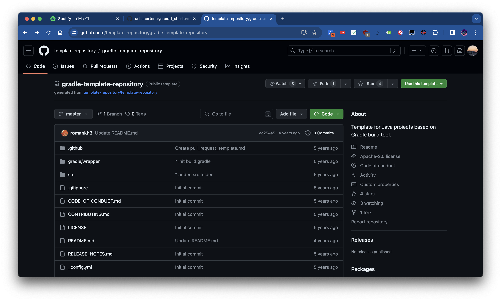

# HeXA Bootcamp 2024 Backend Track 과제 #1


헥사 부트캠프 2024 백엔드 트랙에 오신 것을 환영합니다! 
이 과제는 백엔드 트랙의 첫 번째 과제로, 백엔드 개발자로서 기초적인 API 개발 능력을 키우는 것을 목표로 합니다.
아래의 과제 설명을 자세히 읽어 성공적으로 과제를 완수하시기를 바라겠습니다.

구분 | 내용
--- | ---
과제명 | URL 단축 서비스 개발
제출 기한 | 2024년 3월 29일 오후 11시 59분
과제 설명 | [과제 설명](#과제-설명)
과제 진행 | [과제 진행](#과제-진행)
과제 평가 기준 | [과제 평가 기준](#과제-평가-기준)
ETC | [ETC](#ETC)

## 과제 설명

본 과제에서 여러분은 실생활에서 흔히 볼 수 있는 URL 단축 서비스를 개발합니다.

URL 단축 서비스의 대표적인 예시로는 [Bitly](https://bitly.com/), [TinyURL](https://tinyurl.com/app) 등이 있습니다.

여러분은 수업에서 배운 내용을 활용하여, 
URL 단축 서비스의 주요 기능들을 SQL 데이터베이스를 활용해 REST API로써 구현해야 합니다.

> [!NOTE]\
> 데이터베이스는 SQLite를 사용해주시기 바랍니다. 이는 개발 환경 구축의 복잡도를 줄이기 위함입니다.
> 또한 다음 과제에서도 SQLite에 기반한 배포 환경을 구축할 예정이기 때문에, 이번 과제에서는 SQLite를 사용해주시기 바랍니다.

구체적으로, 아래와 같은 기능들을 구현해야 합니다.

### 1. 단축 URL 생성

사용자가 입력한 URL을 단축 URL로 변환합니다.

이 기능은 변환하고자 하는 URL을 입력받아, 
해당 URL에 대한 고유한 슬러그를 생성한 뒤 
URL Shortener가 호스팅되는 서버의 도메인과 결합하여 단축 URL을 생성합니다.

만약 이미 생성된 URL에 대해 단축 URL을 생성하려고 할 경우, 
새로 생성하는 것이 아니라 기존에 생성된 단축 URL을 반환해야 합니다.

> 슬러그란 단축 URL의 경로 부분에 해당하는 문자열을 의미하며, 예를 들어 `http(s)://your-url-shortener.com/abc123`에서 `abc123`이 슬러그에 해당합니다. 자세한 내용은 아래 입출력 예시를 참고하시기 바랍니다.

또한, URL의 형식이 올바르지 않은 경우에는 적절한 에러 메시지를 반환해야 합니다. 자세한 내용은 아래의 엔드포인트 명세를 참고하시기 바랍니다.

#### 엔드포인트 명세

- 엔드포인트 경로: `POST /`
- 요청 데이터: JSON 형식의 객체
  - `url`: 단축하고자 하는 URL
- 응답 데이터: JSON 형식의 객체
  - `original_url`: 요청 시에 입력한 URL
  - `short_slug`: 생성된 단축 URL의 슬러그.
  - `short_url`: 생성된 단축 URL. 서버의 주소와 `short_slug`를 결합하여 생성됩니다.
- 응답 상태 코드:
  - `201 Created`: 단축 URL이 새로 생성된 경우
  - `200 OK`: 이미 생성된 단축 URL을 요청받아 반환하는 경우
  - `400 Bad Request`: 올바르지 않은 형식의 URL이 입력된 경우 (예: `http-misspelled://example.com`)

#### 입출력 예시

아래 입출력 예시에서는 서버의 주소를 `http://localhost:8000`이라고 가정합니다.

##### 요청-1

```bash
POST http://localhost:8000/ HTTP/1.1
Content-Type: application/json

{
  "url": "https://some-very-long-url.com/with/many/segments"
}
```

##### 응답-1

```bash
HTTP/1.1 201 Created
Content-Type: application/json

{
  "original_url": "https://some-very-long-url.com/with/many/segments",
  "short_slug": "abc123",
  "short_url": "http://localhost:8000/abc123"
}
```

##### 요청-2

```bash
POST http://localhost:8000/ HTTP/1.1
Content-Type: application/json

{
  "url": "http-misspelled://example.com"
}
```

##### 응답-2

```bash
HTTP/1.1 400 Bad Request
Content-Type: application/json

{
  "error": "Invalid URL format"
}
```

### 2. 단축 URL 접속

사용자가 [1번 기능](#1-단축-url-생성)에서 생성한 단축 URL로 접속하면, 원래의 URL로 리다이렉트합니다.

만약 단축 URL이 존재하지 않는 경우에는 적절한 에러 메시지를 반환해야 합니다.

#### 엔드포인트 명세

- 엔드포인트 경로: `GET /<slug>`
  - `<slug>`: 단축 URL의 슬러그
- 응답 상태 코드:
  - `308 Permanent Redirect`: 단축 URL이 존재하는 경우
  - `404 Not Found`: 단축 URL이 존재하지 않는 경우

#### 입출력 예시

아래 입출력 예시에서는 서버의 주소를 `http://localhost:8000`이라고 가정합니다.
또한 `https://some-very-long-url.com/with/many/segments`에 대한 단축 URL이 `http://localhost:8000/abc123`이라고 가정하며, 해당 단축 URL 외에 다른 단축 URL은 존재하지 않는다고 가정합니다.

##### 요청-1

```bash
GET http://localhost:8000/abc123 HTTP/1.1
```

##### 응답-1

```bash
HTTP/1.1 308 Permanent Redirect
Location: https://some-very-long-url.com/with/many/segments
```

##### 요청-2

```bash
GET http://localhost:8000/nonexistent-slug HTTP/1.1
```

##### 응답-2

```bash
HTTP/1.1 404 Not Found
Content-Type: application/json

{
  "error": "URL not found"
}
```

### 3. Health Check Endpoint

실제 프로덕션에서 API 서버들은 종종 `/` 경로에 health check 엔드포인트를 만들어 둡니다.
[Health Check](https://hahava.github.io/dev_log/healthcheck)란 서버가 정상적으로 동작하는지를 확인하는 것으로,
Kubernetes, AWS ELB 등의 로드 밸런서들이 이 엔드포인트를 통해 서버의 상태를 확인합니다.

#### 엔드포인트 명세

- 엔드포인트 경로: `GET /`
- 응답 상태 코드: `200 OK`

## Pre-requisites

본 과제를 수행하기 위해서는 다음의 사항이 필요합니다.

- Python 3.11 이상의 버전
- Github 계정

> [!NOTE]\
> Python `3.11.0` 버전에서 호환성 문제가 발생한 사례가 있습니다. 
> 따라서 과제를 진행하실 적에 `3.11.0` 보다 높은 버전의 Python을 사용하시기 바랍니다.
> 본 URL Shortener 템플릿은 Python `3.11.8` 버전에서 테스트되었습니다.

## 과제 진행

본 과제는 아래와 같은 형식으로 진행해주시기 바랍니다.

### 1. 프라이빗 리포지토리 생성

본 리포지토리는 [템플릿 리포지토리](https://velog.io/@bgm537/Github%EC%9D%98-%EC%83%88%EB%A1%9C%EC%9A%B4-%EA%B8%B0%EB%8A%A5-Template-repository-%EC%97%90-%EB%8C%80%ED%95%B4-%EC%95%8C%EC%95%84%EB%B3%B4%EC%9E%90-fsjwpt0x00)로, 본 리포지토리를 템플릿으로 사용하여 새로운 리포지토리를 생성할 수 있습니다.

아래 사진처럼 화면 우상단에 있는 `Use this template` 버튼을 클릭하여 본인의 Github 계정에 새로운 프라이빗 리포지토리를 생성해주시기 바랍니다.

리포지토리의 이름은 `url-shortener`로 설정해주시기 바랍니다.



> [!IMPORTANT]\
> **리포지토리의 default 브랜치는 `master`로 설정해주시기 바랍니다.** 추후 과제 완료 확인을 위한 Github Action Workflow가 master 브랜치로의 PR로 트리거될 예정입니다.

### 2. 리포지토리 클론 및 작업 브랜치 생성

본인의 개발 환경에서 새로 생성한 리포지토리를 클론하고, `master` 브랜치로부터 새로운 브랜치인 `develop` 브랜치를 생성해주시기 바랍니다.

추후 `master` 브랜치로의 PR을 생성하는 방식으로 과제를 제출해주시기 때문에, 과제 시작 전 꼭 새로운 브랜치를 생성해주시기 바랍니다.

### 3. 의존성 패키지 설치

본인의 개발 환경에서 본 리포지토리를 클론하고, 아래의 명령어를 실행하여 의존성 패키지들을 설치해주시기 바랍니다.

```bash
pip install -r requirements.txt
```

> [!NOTE]\
> 패키지를 추가하는 것은 자유입니다. 다만, `requirements.txt`에 추가한 패키지들의 목록, 그리고 각각을 추가한 이유를 추후 PR에 명시해주시기 바랍니다.


### 4. API 서버 개발

위의 [과제 설명](#과제-설명)을 토대로 API 서버를 개발해주시기 바랍니다.

#### 프로젝트 구조

```
|- app.py # 애플리케이션의 진입점입니다. `app = FastAPI()` 가 이 파일에서 선언되었습니다.
|- requirements.txt # 애플리케이션 개발에 필요한 종속성이 명세되어 있습니다. 종속성은 마음대로 추가하셔도 무방하지만, 템플릿에서 미리 명세해둔 종속성을 삭제하는 것은 금지됩니다.
|- tests # 테스트 코드가 이 폴더 아래에 들어있습니다.
|- src # 소스 코드를 저장할 수 있는 경로를 미리 만들어두었습니다. `src` 폴더가 아닌 다른 폴더에 애플리케이션 관련 코드를 저장하셔도 무방합니다.
```

### 5. 테스트

`tests/test_url_shortener.py` 파일에 [과제 설명](#과제-설명)에 명시된 각각의 기능에 대한 테스트 코드가 작성되어 있습니다. 프로젝트 루트 디렉터리에서 아래의 명령어를 실행하여 테스트를 수행해주시기 바랍니다.

```bash
python -m pytest tests/test_url_shortener.py
```

> [!IMPORTANT]\
> 다른 모든 코드는 수정해도 무방하나, 아래의 코드들은 수정하시면 안됩니다. 
> - `test_*`로 시작하는 함수들의 구현 (함수의 Body). 이 함수들은 "테스트 코드"이고, 위에서 명세한 기능들이 제대로 구현되었는지를 확인하는 코드이기에, 해당 함수들을 수정하면 과제를 제대로 수행했는지 확인할 수 없게 됩니다.
> - `test_*`로 시작하는 함수들의 fixture (함수의 parameters)를 추가할 수는 있으나, 기존에 사용하고 있는 fixture (이미 들어가 있는 parameters)는 삭제하거나 수정하면 안됩니다.
> - `def shared()` fixture: 이 fixture는 여러 테스트 함수에서 공유하는 데이터를 저장하는 역할을 합니다. 이 fixture를 수정하면 안됩니다.
> - `def client()` fixture: 이 fixture의 함수 구현은 수정해도 무방하나, return 혹은 yield 값은 항상 `TestClient(app)` 이어야 하며, 이때 `app` 은 프로젝트 최상위 경로에 있는 `app.py` 에서 import 되는 것이어야 합니다.

### 6. 과제 제출

과제를 완료하신 후, `master` 브랜치로의 PR을 생성해주시기 바랍니다.

PR의 제목은 "과제 제출: {본인의 학번}/{본인의 이름}"으로 작성해주시기 바랍니다.

PR의 내용은 본 템플릿에 [Pull Request Template](.github/PULL_REQUEST_TEMPLATE.md)이 포함되어 있어 PR 생성 시 해당 템플릿을 이용하실 수 있을 것입니다.

## 과제 평가 기준

- [과제 설명](#과제-설명)에 명시된 기능들이 미리 작성된 테스트 코드를 통과하는지 여부
- 각 함수, 메서드, 클래스 등에 적절한 주석이 작성되어 있는지 여부

## ETC

- 과제 수행 중 궁금한 사항이 있을 경우, 본 저장소의 Issues 탭에 새로운 이슈를 생성하여, 궁금한 사항을 질문해주시기 바랍니다.
